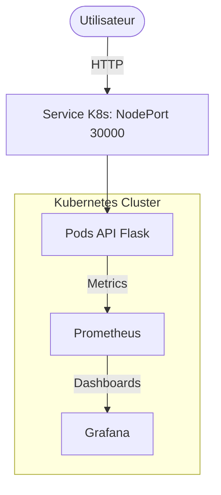

# 📋 Task Manager API - DevOps Project


## 📖 Description

**Task Manager API** est un projet DevOps académique complet démontrant les meilleures pratiques de développement, déploiement et observabilité d'une application moderne.

Ce projet implémente une API REST complète de gestion de tâches (TODO list) avec un focus majeur sur l'ingénierie DevOps :
- 🚀 **CI/CD automatisé** avec GitHub Actions (Tests, Lint, Build, Security Scan)
- 🐳 **Containerisation** Docker multi-stage optimisée
- ☸️ **Orchestration** Kubernetes avec déploiements, services et sondes de santé
- 📊 **Observabilité avancée** : Métriques Prometheus, Tableaux de bord Grafana, Logs structurés JSON et Tracing de requêtes
- 🔒 **Sécurité** : Scans Bandit (SAST), Trivy (Docker) et gestion des politiques de tirage d'images

## 🎯 Fonctionnalités implémentées

1. **API REST CRUD** : Gestion complète des tâches (Create, Read, Update, Delete).
2. **Documentation Swagger** : Interface interactive disponible sur `/swagger`.
3. **Tracing** : Identification unique des requêtes via header `X-Request-ID`.
4. **Monitoring** : Métriques personnalisées (nombre de tâches, taux de requêtes, latence).
5. **Infrastructure as Code** : Manifestes Kubernetes complets pour l'application et la stack de monitoring.

## 🏗️ Architecture du Projet



## 🚀 Guide de Démarrage Rapide

### 🔧 Installation et Lancement Local

```bash
# 1. Cloner et configurer l'environnement
git clone https://github.com/NourMoussi/devops-project-.git
cd devops-project-
python -m venv venv
.\venv\Scripts\Activate.ps1  # Windows
source venv/bin/activate     # Linux/Mac

# 2. Installer les dépendances
pip install -r requirements.txt

# 3. Lancer l'API
python app.py
```
L'API est accessible sur `http://localhost:5000` et le Swagger sur `http://localhost:5000/swagger`.

### ☸️ Déploiement sur Kubernetes (Minikube/Kind)

```powershell
# Déployer l'API
kubectl apply -f k8s/deployment.yaml
kubectl apply -f k8s/service.yaml

# Déployer la stack de Monitoring
kubectl apply -f k8s/prometheus.yaml
kubectl apply -f k8s/grafana.yaml
```

## 📊 Observabilité et Monitoring

Le projet inclut une stack de monitoring pré-configurée.

### 1. Accès aux Interfaces

| Outil | Commande de redirection | URL |
|-------|-------------------------|-----|
| **API (Direct)** | `minikube service task-manager-api-service --url` | `http://<minikube-ip>:30000` |
| **Prometheus** | `kubectl port-forward service/prometheus 9091:9090` | [http://localhost:9091](http://localhost:9091) |
| **Grafana** | `kubectl port-forward service/grafana 3000:3000` | [http://localhost:3000](http://localhost:3000) |

### 2. Identifiants Grafana
- **Utilisateur** : `admin`
- **Mot de passe** : `admin`

Le tableau de bord **"Task Manager API Dashboard"** est automatiquement importé et connecté à Prometheus.

## 📝 API Endpoints

| Méthode | Endpoint | Description |
|---------|----------|-------------|
| GET | `/health` | État de santé de l'API |
| GET | `/metrics` | Métriques brutes pour Prometheus |
| GET | `/tasks` | Liste toutes les tâches |
| POST | `/tasks` | Ajouter une tâche (JSON: `title`, `description`) |
| GET | `/tasks/<id>` | Détails d'une tâche spécifique |
| PUT | `/tasks/<id>` | Modifier une tâche |
| DELETE | `/tasks/<id>` | Supprimer une tâche |

## 🛠️ Stack Technique

- **Langage** : Python 3.9+
- **Framework** : Flask, Marshmallow (validation)
- **Monitoring** : Prometheus, Grafana
- **DevOps** : Docker, Kubernetes, GitHub Actions
- **Qualité** : Pytest, Bandit, Trivy

## 📄 Licence

Ce projet est sous licence MIT. Voir le fichier [LICENSE](LICENSE) pour plus de détails.

---
**Auteur : Nour Moussi**
